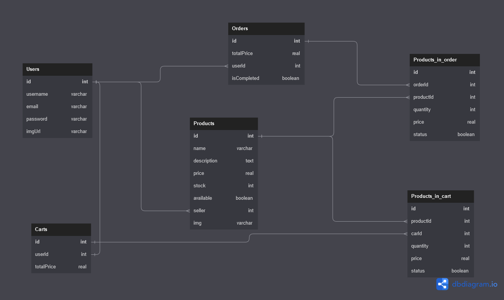

# Proyecto - Final

## Objetivo general

Aplicar todos los conocimientos vistos en clase para levantar esta API desde 0,
mas consideraciones de seguridad y para lanzar a producción en Railway / render.

### El proyecto debe cumplir con los siguientes puntos

1. Conectarse a una base de datos

2. Se deben crear los siguientes modelos:

    - [x] Users
    - [x] Products
    - [x] Carts
    - [x] Orders
    - [ ] ProductInCart
    - [ ] ProductInOrder

3. Debe contener los siguientes puntos:

    - [ ] Crear usuarios y encriptar sus contraseñas con Bcrypt
    - [ ] Iniciar sesión y generar JWT
    - [ ] Editar un usuario ( username y avatar )
    - [ ] Crear la validaciones pertinentes para cada endpoint ( express validator)
    - [ ] Obtener todos los productos que su cantidad sea mayor que 0, debe incluir el nombre del usuario quien esta vendiendo el producto
    - [ ] Crear un nuevo producto, incluyendo una imagen
    - [ ] Poder editar la descripción de un producto
    - [ ] Agregar un producto al carrito
    - [ ] Mostrar todos los productos que el usuario tiene hasta el momento en su carrito
    - [ ] Realizar una compra, todos los productos en el carrito se marcan como comprados y el carrito cambia a status ‘purchased’
    - [ ] Ver todas las ordenes del usuario
    - [ ] Mandar un correo cuando un usuario crea una cuenta y cuando realiza una compra(no hay verificación de email)
    - [ ] Tu api debe tener una página de documentación con los endpoints que usas y que se pueda probar, incluyendo los campos requeridos para las peticiones y una sección para incluir el token de autenticación si es necesario. (swwager)

4. Reto opcional

    - [ ] Generar un endpoint para recuperar contraseña.

> 💡 Tip: Para recuperar una contraseña un usuario llena un formulario donde solamente manda su correo electrónico. Posteriomente llega un mensaje a su correo electrónico con un enlace que incluye un token. Este enlace lo lleva a una pagina que tiene un formulario para restablecer la contraseña. Cuando da enviar, envía la contraseña nueva y el token del enlace.

## Diseño de la base de datos

[⭡backtotop](#proyecto---final)
